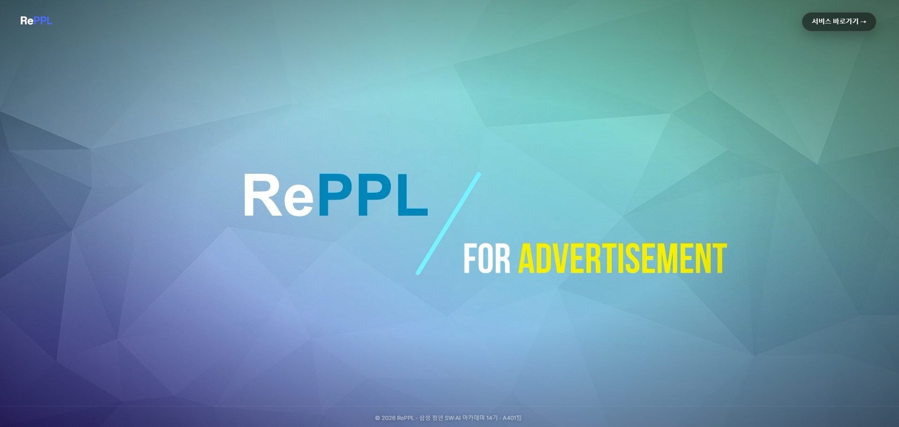
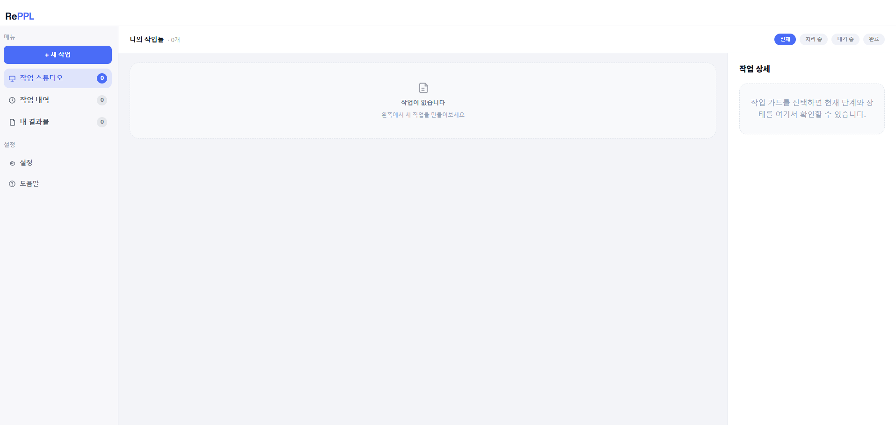
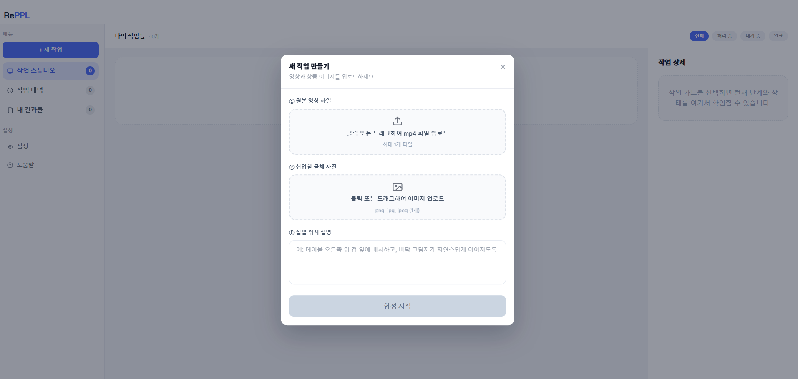
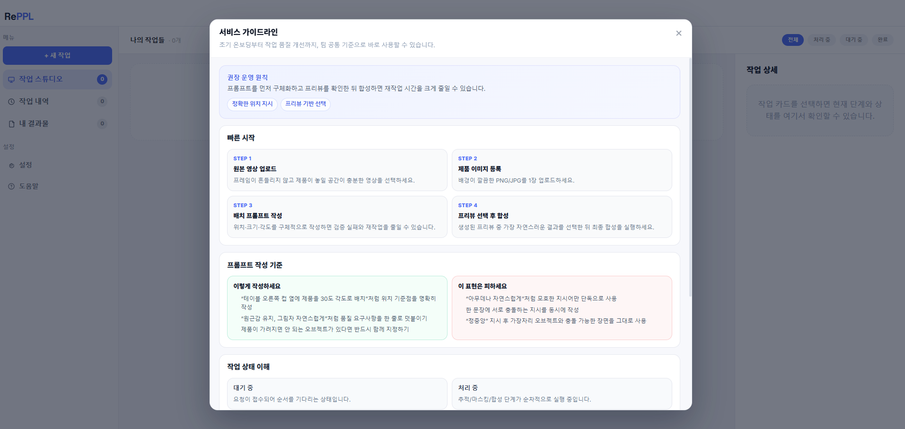
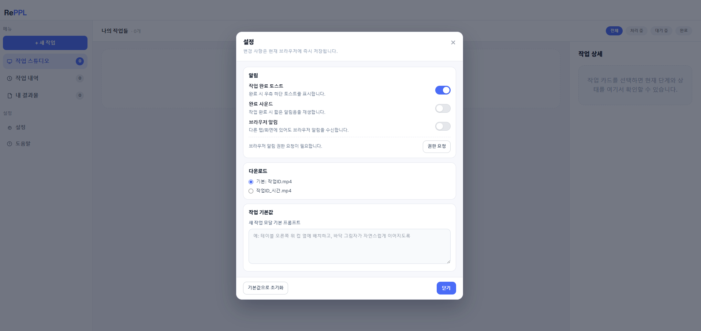

# 시연 시나리오

## 시연 개요

**RePPL** — AI 기반 영상 PPL(Product Placement) 합성 플랫폼

사용자가 원본 영상과 제품 이미지를 업로드하고 배치 프롬프트를 입력하면,  
AI가 Gemini를 통해 프리뷰 이미지를 생성하고, 선택된 프리뷰를 기반으로  
Grounding DINO + SAM을 활용하여 영상 전체 프레임에 제품을 자연스럽게 합성합니다.

### 시연 예상 시간: 약 8~12분

---

## SCENE 1. 랜딩 페이지 (서비스 소개)

### 화면: `/` (메인 랜딩 페이지)



| 순서 | 액션 | 세부 설명 |
|------|------|-----------|
| 1-1 | 브라우저에서 `https://j14a401.p.ssafy.io` 접속 | 풀스크린 배경 영상이 자동 재생되는 랜딩 페이지가 표시됨 |
| 1-2 | 랜딩 페이지 확인 | 좌상단에 **RePPL** 로고, 우상단에 **"서비스 바로가기 →"** 버튼이 표시됨 |
| 1-3 | 하단 푸터 확인 | "© 2026 RePPL · 삼성 청년 SW·AI 아카데미 14기 · A401팀" 텍스트 확인 |
| 1-4 | 시연 모드 활성화 | 좌상단 **RePPL 로고 영역을 더블클릭** (투명 버튼) → 시연 잠금 해제 |
| 1-5 | "서비스 바로가기 →" 버튼 클릭 | 우상단 버튼 클릭 → 워크스페이스 페이지(`/studio`)로 이동 |

> **참고**: 시연 모드가 해제되지 않은 상태에서 "서비스 바로가기" 클릭 시  
> `"현재 시연중이므로 사용할 수 없습니다."` 알림이 표시됩니다.

---

## SCENE 2. 워크스페이스 - 인터페이스 소개

### 화면: `/studio` (작업 스튜디오)

| 순서 | 액션 | 세부 설명 |
|------|------|-----------|
| 2-1 | 워크스페이스 전체 레이아웃 확인 | 상단: 로고 바, 좌측: 사이드바 메뉴, 우측: 메인 작업 영역 |
| 2-2 | 좌측 사이드바 메뉴 설명 | **메뉴** 섹션: `+ 새 작업`, `작업 스튜디오`, `작업 내역`, `내 결과물` |
| 2-3 | 좌측 사이드바 하단 설명 | **설정** 섹션: `설정`, `도움말` |
| 2-4 | **도움말** 클릭 | 좌측 사이드바 하단의 **도움말** 버튼 클릭 → 가이드 모달 팝업 |

---

## SCENE 3. 도움말 가이드 (서비스 사용법)

### 화면: 도움말 모달 (오버레이)

| 순서 | 액션 | 세부 설명 |
|------|------|-----------|
| 3-1 | 가이드 모달 상단 확인 | **"서비스 가이드라인"** 제목, "초기 온보딩부터 작업 품질 개선까지..." 설명 |
| 3-2 | **권장 운영 원칙** 확인 | "프롬프트를 먼저 구체화하고 프리뷰를 확인한 뒤 합성하면 재작업 시간을 크게 줄일 수 있습니다." 배지: `정확한 위치 지시`, `프리뷰 기반 선택` |
| 3-3 | **빠른 시작** 4단계 확인 | STEP 1: 원본 영상 업로드 → STEP 2: 제품 이미지 등록 → STEP 3: 배치 프롬프트 작성 → STEP 4: 프리뷰 선택 후 합성 |
| 3-4 | **프롬프트 작성 기준** 확인 | ✅ 이렇게 작성하세요 / ❌ 이 표현은 피하세요 (좋은/나쁜 예시 비교) |
| 3-5 | **작업 상태 이해** 확인 | 대기 중, 처리 중, 완료, 실패 각 상태별 설명 카드 |
| 3-6 | **자주 묻는 질문** 확인 | FAQ 아코디언 (3개 항목) — 클릭하여 답변 열어 보기 |
| 3-7 | 모달 닫기 | 우상단 **×** 버튼 또는 모달 바깥 영역 클릭 |

---

## SCENE 4. 새 작업 생성 (핵심 시연)

### 화면: `/studio` → 새 작업 모달

| 순서 | 액션 | 세부 설명 |
|------|------|-----------|
| 4-1 | **"+ 새 작업"** 버튼 클릭 | 좌측 사이드바 상단의 **+ 새 작업** 버튼 클릭 → 작업 생성 모달 표시 |
| 4-2 | **① 원본 영상 파일** 업로드 | 드래그&드롭 영역에 **.mp4 영상 파일**을 드래그하여 놓기 또는 클릭하여 파일 탐색기에서 선택. 업로드 후 영상 미리보기가 표시됨 |
| 4-3 | 영상 미리보기 확인 | 업로드된 영상의 축소판 재생, 파일명 및 용량(MB) 표시 확인 |
| 4-4 | **② 삽입할 물체 사진** 업로드 | 드래그&드롭 영역에 **제품 이미지 파일(PNG/JPG)**을 업로드. 업로드 후 이미지 썸네일이 표시됨 |
| 4-5 | 이미지 미리보기 확인 | 업로드된 제품 이미지 썸네일, 파일명, 용량 표시 확인 |
| 4-6 | **③ 삽입 위치 설명** 프롬프트 입력 | 텍스트 영역에 한국어로 배치 위치를 구체적으로 작성. 예: `"테이블 오른쪽 위 컵 옆에 배치하고, 바닥 그림자가 자연스럽게 이어지도록"` |
| 4-7 | **"합성 시작"** 버튼 클릭 | 하단의 파란색 **합성 시작** 버튼 클릭. 3가지 필드가 모두 채워져야 활성화됨 |
| 4-8 | 업로드 진행 확인 | 프로그레스 바가 순차적으로 진행: `"영상 업로드 중..."` → `"이미지 업로드 중..."` → `"합성 작업 생성 중..."` |

---

## SCENE 5. 프리뷰 생성 대기 (실시간 진행률)

### 화면: `/studio` → 작업 스튜디오

| 순서 | 액션 | 세부 설명 |
|------|------|-----------|
| 5-1 | 작업 카드 확인 | 작업 목록에 새로 생성된 **프리뷰 생성 작업** 카드가 나타남. 상태: `대기 중` (회색 뱃지) → `처리 중` (주황색 뱃지) |
| 5-2 | 작업 카드 클릭 | 생성된 작업 카드를 **클릭** → 우측에 **작업 상세 패널** 표시 |
| 5-3 | 작업 상세 패널 확인 | - 작업 ID (UUID) 표시 - `프리뷰 생성 작업` 라벨 - 처리 진행률 바 (%) - 처리 단계: `첫 프레임 Gemini 합성` (애니메이션 아이콘) |
| 5-4 | 실시간 진행률 확인 (WebSocket) | 진행률이 실시간으로 업데이트됨: `5%` 다운로드 → `10%~80%` Gemini 프리뷰 생성 → `92%` 업로드 → `100%` 완료 |
| 5-5 | 상태 변경 확인 | 완료 시 상태 뱃지가 `완료` (초록색)으로 변경, 하단에 **"프리뷰 선택하기"** 버튼 활성화 |

> **참고**: Gemini API를 통한 프리뷰 생성에는 약 1~3분 소요됩니다.  
> 이 시간 동안 WebSocket을 통해 실시간 진행률이 표시됩니다.

---

## SCENE 6. 프리뷰 선택

### 화면: 프리뷰 선택 모달 (오버레이)

| 순서 | 액션 | 세부 설명 |
|------|------|-----------|
| 6-1 | **"프리뷰 선택하기"** 클릭 | 작업 상세 패널 하단의 버튼 클릭 → 프리뷰 선택 모달 팝업 |
| 6-2 | 프리뷰 이미지 확인 | **3장의 프리뷰 이미지**가 그리드로 표시됨. 각 이미지는 Gemini가 제품을 합성한 첫 프레임 결과 |
| 6-3 | 프리뷰 확대 보기 | 각 프리뷰 이미지 우하단의 **돋보기(🔍) 아이콘**을 클릭 → 라이트박스로 확대 표시. 좌우 화살표로 탐색 가능, ESC로 닫기 |
| 6-4 | 프리뷰 선택 | 가장 자연스러운 프리뷰 이미지를 **클릭**하여 선택 (테두리가 파란색으로 강조, 체크 아이콘 표시) |
| 6-5 | **"선택하고 합성 시작"** 클릭 | 하단 우측의 파란색 **"선택하고 합성 시작"** 버튼 클릭 → 최종 합성 작업이 생성됨 |

---

## SCENE 7. 최종 합성 진행 (실시간 단계별 진행)

### 화면: `/studio` → 작업 상세 패널

| 순서 | 액션 | 세부 설명 |
|------|------|-----------|
| 7-1 | 합성 작업 카드 확인 | 새로운 **최종 합성 작업** 카드가 작업 목록에 추가됨 |
| 7-2 | 합성 작업 클릭 | 합성 작업 카드 클릭 → 우측 상세 패널에서 단계별 진행 확인 |
| 7-3 | **처리 단계** 실시간 확인 | 8단계가 순차적으로 진행됨 (각 단계별 아이콘 상태 변화): |
|  | | ① `입력 파일 다운로드` — S3에서 영상/이미지 다운로드 |
|  | | ② `Grounding DINO 객체 검출` — 프리뷰 이미지에서 객체 위치 검출 |
|  | | ③ `SAM 마스크 추출` — 검출된 객체의 정밀 세그멘테이션 마스크 생성 |
|  | | ④ `그림자 생성` — 객체 하단 그림자 맵 생성 |
|  | | ⑤ `객체 크기 조정` — 원본 영상 프레임에 맞는 스케일 보정 |
|  | | ⑥ `깊이 추정` — 장면 깊이 맵 계산 |
|  | | ⑦ `전체 프레임 합성` — Optical Flow 기반 전체 영상 프레임 합성 |
|  | | ⑧ `최종 합성 업로드` — H.264 인코딩 후 S3 업로드 |
| 7-4 | 진행률 변화 확인 | 각 단계에서 진행률(%)이 실시간으로 업데이트됨. 현재 단계는 파란 원 애니메이션, 완료 단계는 초록 체크, 대기 단계는 회색 원 |
| 7-5 | 합성 완료 확인 | 모든 단계 완료 → 상태 `완료` (초록색 뱃지), 진행률 100% |

> **참고**: 전체 합성에는 영상 길이와 해상도에 따라 약 2~5분 소요됩니다.

---

## SCENE 8. 결과 확인 및 다운로드

### 화면: `/studio` → 작업 상세 패널 또는 내 결과물

| 순서 | 액션 | 세부 설명 |
|------|------|-----------|
| 8-1 | **"결과 다운로드"** 버튼 클릭 | 작업 상세 패널 하단의 초록색 **"결과 다운로드"** 버튼 클릭 → 합성 완료된 영상(.mp4) 다운로드 시작 |
| 8-2 | 다운로드된 영상 재생 | 로컬에 다운로드된 `{작업ID}.mp4` 파일을 미디어 플레이어로 재생하여 합성 결과 확인 |
| 8-3 | **"내 결과물"** 메뉴 클릭 | 좌측 사이드바에서 **내 결과물** 메뉴 클릭 → 완료된 합성 작업 목록 표시 |
| 8-4 | 결과물 목록 확인 | 완료된 합성 작업(COMPOSITE + COMPLETED)만 필터링된 목록 표시 |

---

## SCENE 9. 작업 내역 확인

### 화면: `/studio` → 작업 내역

| 순서 | 액션 | 세부 설명 |
|------|------|-----------|
| 9-1 | **"작업 내역"** 메뉴 클릭 | 좌측 사이드바에서 **작업 내역** 메뉴 클릭 |
| 9-2 | 전체 작업 목록 확인 | 프리뷰 생성 + 합성 모든 작업이 시간순으로 표시됨 |
| 9-3 | 필터 탭 사용 | 상단 필터 탭으로 작업 분류: `전체` / `처리 중` / `대기 중` / `완료` |
| 9-4 | 각 작업 카드 상태 확인 | 작업별 상태 뱃지 색상: 대기중(회색), 처리중(주황), 완료(초록), 실패(빨간) |

---

## SCENE 10. 설정 (선택적 시연)

### 화면: 설정 모달 (오버레이)

| 순서 | 액션 | 세부 설명 |
|------|------|-----------|
| 10-1 | **설정** 버튼 클릭 | 좌측 사이드바 하단의 **설정** 버튼 클릭 → 설정 모달 팝업 |
| 10-2 | **알림** 설정 확인 | 작업 완료 토스트 ON/OFF, 완료 사운드 ON/OFF, 브라우저 알림 ON/OFF 토글 스위치 |
| 10-3 | **다운로드** 설정 확인 | 파일명 패턴 선택: `기본: 작업ID.mp4` / `작업ID_시간.mp4` 라디오 버튼 |
| 10-4 | **작업 기본값** 확인 | 새 작업 모달 기본 프롬프트 텍스트 영역 |
| 10-5 | 설정 닫기 | **닫기** 버튼 또는 **기본값으로 초기화** 버튼 시연 후 모달 닫기 |

---

## SCENE 11. 토스트 알림 (선택적 시연)

### 화면: 작업 진행 중 다른 화면에 있을 때

| 순서 | 액션 | 세부 설명 |
|------|------|-----------|
| 11-1 | 작업 생성 후 다른 메뉴로 이동 | 작업을 생성한 후 다른 섹션(내 결과물 등)으로 이동 |
| 11-2 | 작업 완료 토스트 확인 | 작업이 완료되면 **우측 하단에 토스트 알림** 팝업: "작업이 완료되었습니다!" 메시지, 작업 ID 일부 표시 |
| 11-3 | 토스트 클릭 | 토스트를 클릭하면 해당 작업이 있는 스튜디오로 이동하거나 상세 보기 |

---

## 시연 시나리오 요약 (Quick View)

```
1. 랜딩 페이지 접속 → 배경 영상 확인
2. 로고 더블클릭으로 시연 모드 해제
3. "서비스 바로가기" 클릭 → 스튜디오 이동
4. 도움말 확인 (빠른 시작 4단계, 프롬프트 작성 가이드)
5. "+ 새 작업" → 영상 업로드 → 제품 이미지 업로드 → 프롬프트 입력
6. "합성 시작" 클릭 → 업로드 진행
7. 프리뷰 생성 실시간 진행률 확인 (WebSocket)
8. 프리뷰 3장 확인 → 최적 이미지 선택
9. "선택하고 합성 시작" → 8단계 합성 파이프라인 실시간 확인
10. 합성 완료 → 결과 영상 다운로드 → 재생 확인
11. 작업 내역 / 내 결과물 확인
```

---

## 시연 준비 체크리스트

- [ ] EC2 서버가 정상 동작 중인지 확인 (`docker ps`로 모든 컨테이너 Running 확인)
- [ ] GPU 서버에서 AI Worker가 실행 중인지 확인 (`ps aux | grep worker`)
- [ ] 시연용 원본 영상 파일(.mp4) 준비 (5~15초, 1080p 권장)
- [ ] 시연용 제품 이미지 파일(.png/.jpg) 준비 (배경이 깔끔한 제품 사진)
- [ ] 시연용 프롬프트 사전 작성 (구체적인 위치 지시)
- [ ] 인터넷 연결 상태 확인
- [ ] 브라우저 캐시 초기화 (필요 시)
- [ ] 랜딩 페이지 배경 영상이 정상 재생되는지 확인

---
---

# 부록: 화면별 상세 가이드라인

> 이하 내용은 각 화면의 UI 요소와 버튼 동작을 스크린샷과 함께 상세히 설명합니다.

---

## A. 홈 화면 (랜딩 페이지)


서비스 접속 시 가장 먼저 표시되는 **랜딩 페이지**입니다. 풀스크린 배경 위에 서비스 소개와 진입 버튼이 배치되어 있습니다.

### A-1. 화면 구성

| 위치 | 요소 | 설명 |
|------|------|------|
| **좌상단** | `RePPL` 로고 | 서비스 로고입니다. "Re"는 흰색, "PPL"은 파란색으로 표시됩니다. **로고 영역을 더블클릭**하면 시연 모드 잠금이 해제됩니다 (투명 버튼이 오버레이되어 있음). |
| **중앙** | `RePPL / FOR ADVERTISEMENT` | 서비스의 핵심 슬로건입니다. "RePPL"은 크게 표시되고, "FOR ADVERTISEMENT" 중 "ADVERTISEMENT"는 노란색으로 강조됩니다. |
| **우상단** | `서비스 바로가기 →` 버튼 | 반투명 배경의 둥근 버튼입니다. **클릭** 시 작업 스튜디오(`/studio`) 페이지로 이동합니다. |
| **배경** | 그라데이션 배경 | 청록~회색 톤의 폴리곤 패턴 배경이 표시됩니다. (영상이 설정된 경우 자동 재생 배경 영상으로 대체됩니다.) |
| **하단** | 푸터 | "© 2026 RePPL · 삼성 청년 SW·AI 아카데미 14기 · A401팀" — 팀 및 저작권 정보가 표시됩니다. |

### A-2. 주요 버튼 동작

| 버튼/액션 | 동작 |
|-----------|------|
| **`서비스 바로가기 →`** 클릭 | 시연 모드가 해제된 상태에서만 작업 스튜디오로 이동합니다. 해제되지 않은 상태에서 클릭하면 `"현재 시연중이므로 사용할 수 없습니다."` 알림이 표시됩니다. |
| **RePPL 로고 더블클릭** | 시연 모드 잠금을 해제합니다. 해제 후 "서비스 바로가기" 버튼이 정상 동작합니다. (발표/시연 시 필수 동작) |

---

## B. 작업 스튜디오 (메인 화면)



홈 화면에서 **`서비스 바로가기`**를 클릭하면 이동하는 **메인 작업 화면**입니다. 크게 3개 영역으로 구성됩니다.

### B-1. 좌측 사이드바

| 영역 | 요소 | 설명 |
|------|------|------|
| **메뉴** | `+ 새 작업` 버튼 (파란색) | 클릭 시 **새 작업 만들기** 모달이 열립니다. 영상과 제품 이미지를 업로드하여 합성 작업을 시작할 수 있습니다. |
| | `작업 스튜디오` (0) | 현재 진행 중이거나 완료된 모든 작업을 확인하는 메인 뷰입니다. 숫자는 활성 작업 수를 나타냅니다. 파란색 하이라이트가 현재 선택된 메뉴임을 표시합니다. |
| | `작업 내역` (0) | 과거에 생성한 모든 작업의 이력을 시간순으로 확인합니다. |
| | `내 결과물` (0) | 합성이 완료된 결과 영상만 모아 볼 수 있습니다. |
| **설정** | `설정` ⚙ | 알림, 다운로드, 기본 프롬프트 등 사용자 설정을 변경합니다. |
| | `도움말` ⓘ | 서비스 사용 가이드라인 모달을 엽니다. |

### B-2. 중앙 작업 목록 영역

| 요소 | 설명 |
|------|------|
| **나의 작업들 · 0개** | 현재 생성된 작업의 총 개수를 표시합니다. |
| **필터 탭** (우상단) | `전체` · `처리 중` · `대기 중` · `완료` — 작업 상태별로 필터링할 수 있는 탭 버튼입니다. 현재 선택된 탭은 **파란색 배경**으로 강조됩니다. |
| **빈 상태 안내** | 작업이 없을 때 파일 아이콘과 함께 **"작업이 없습니다"**, **"왼쪽에서 새 작업을 만들어보세요"** 안내 메시지가 표시됩니다. |

### B-3. 우측 작업 상세 패널

| 요소 | 설명 |
|------|------|
| **작업 상세** | 작업 카드를 선택했을 때 해당 작업의 상세 정보(진행 단계, 상태, 진행률 등)를 표시하는 패널입니다. |
| **안내 메시지** | 선택된 작업이 없을 때 점선 테두리 내에 **"작업 카드를 선택하면 현재 단계와 상태를 여기서 확인할 수 있습니다."** 안내 문구가 표시됩니다. |

---

## C. 새 작업 만들기 (작업 생성 모달)



좌측 사이드바의 **`+ 새 작업`** 버튼을 클릭하면 나타나는 모달 팝업입니다.

### C-1. 모달 헤더

| 요소 | 설명 |
|------|------|
| **새 작업 만들기** (제목) | 모달 상단에 굵은 글씨로 표시됩니다. |
| **설명 텍스트** | "영상과 상품 이미지를 업로드하세요" — 입력이 필요한 내용을 안내합니다. |
| **× 닫기 버튼** (우상단) | 모달을 닫고 이전 화면으로 돌아갑니다. |

### C-2. 입력 필드

#### ① 원본 영상 파일

| 요소 | 설명 |
|------|------|
| **드래그&드롭 영역** | 점선 테두리의 넓은 영역입니다. |
| **업로드 아이콘** ⬆ | 영역 중앙에 위쪽 화살표 아이콘이 표시됩니다. |
| **안내 텍스트** | **"클릭 또는 드래그하여 mp4 파일 업로드"** — 영역을 **클릭**하면 파일 탐색기가 열리고, mp4 파일을 **드래그&드롭**으로도 업로드할 수 있습니다. |
| **파일 제한** | "최대 1개 파일" — mp4 형식의 영상 파일 1개만 업로드 가능합니다. |

#### ② 삽입할 물체 사진

| 요소 | 설명 |
|------|------|
| **드래그&드롭 영역** | ①과 동일한 형태의 점선 테두리 영역입니다. |
| **이미지 아이콘** 🖼 | 영역 중앙에 이미지 파일 아이콘이 표시됩니다. |
| **안내 텍스트** | **"클릭 또는 드래그하여 이미지 업로드"** — 영역을 **클릭**하거나 **드래그&드롭**으로 업로드합니다. |
| **파일 제한** | "png, jpg, jpeg (1개)" — 이미지 파일 1장만 업로드 가능합니다. 배경이 깔끔한 제품 사진을 권장합니다. |

#### ③ 삽입 위치 설명

| 요소 | 설명 |
|------|------|
| **프롬프트 입력 영역** | 여러 줄 입력 가능한 텍스트 영역(textarea)입니다. |
| **플레이스홀더** | *"예: 테이블 오른쪽 위 컵 옆에 배치하고, 바닥 그림자가 자연스럽게 이어지도록"* — 구체적인 배치 위치와 조건을 한국어로 작성합니다. |

### C-3. 합성 시작 버튼

| 요소 | 설명 |
|------|------|
| **`합성 시작`** 버튼 | 모달 하단의 넓은 버튼입니다. ①영상, ②이미지, ③프롬프트 세 가지가 모두 입력되어야 **활성화**(파란색)됩니다. 입력이 부족하면 **비활성**(회색) 상태입니다. |
| **클릭 시 동작** | 클릭하면 순서대로 `영상 업로드 중...` → `이미지 업로드 중...` → `합성 작업 생성 중...` 단계를 거치며, 프로그레스 바가 진행 상황을 표시합니다. 완료 후 모달이 닫히고 작업 목록에 새 작업 카드가 추가됩니다. |

---

## D. 서비스 가이드라인 (도움말 모달)



좌측 사이드바의 **`도움말`** 버튼을 클릭하면 나타나는 가이드라인 모달입니다.

### D-1. 모달 헤더

| 요소 | 설명 |
|------|------|
| **서비스 가이드라인** (제목) | 모달 상단 좌측에 굵은 글씨로 표시됩니다. |
| **설명 텍스트** | "초기 온보딩부터 작업 품질 개선까지, 팀 공통 기준으로 바로 사용할 수 있습니다." |
| **× 닫기 버튼** (우상단) | 모달을 닫고 이전 화면으로 돌아갑니다. |

### D-2. 권장 운영 원칙

| 요소 | 설명 |
|------|------|
| **초록색 강조 영역** | "프롬프트를 먼저 구체화하고 프리뷰를 확인한 뒤 합성하면 재작업 시간을 크게 줄일 수 있습니다." — 서비스 사용의 핵심 원칙을 안내합니다. |
| **뱃지** | `정확한 위치 지시`, `프리뷰 기반 선택` — 핵심 키워드를 태그 형태로 강조합니다. |

### D-3. 빠른 시작 (4단계)

서비스 사용 흐름을 4개의 카드로 안내합니다.

| 카드 | 제목 | 설명 |
|------|------|------|
| **STEP 1** | 원본 영상 업로드 | "프레임이 흔들리지 않고 제품이 놓일 공간이 충분한 영상을 선택하세요." |
| **STEP 2** | 제품 이미지 등록 | "배경이 깔끔한 PNG/JPG를 1장 업로드하세요." |
| **STEP 3** | 배치 프롬프트 작성 | "위치·크기·각도를 구체적으로 작성하면 검증 실패와 재작업을 줄일 수 있습니다." |
| **STEP 4** | 프리뷰 선택 후 합성 | "생성된 프리뷰 중 가장 자연스러운 결과를 선택한 뒤 최종 합성을 실행하세요." |

### D-4. 프롬프트 작성 기준

좋은 프롬프트와 나쁜 프롬프트를 색상으로 구분하여 비교합니다.

| 카드 | 내용 |
|------|------|
| **✅ 이렇게 작성하세요** (초록 테두리) | · "테이블 오른쪽 컵 옆에 제품을 30도 각도로 배치"처럼 위치 기준점을 명확히 작성 |
| | · "원근감 유지, 그림자 자연스럽게"처럼 품질 요구사항을 한 줄로 덧붙이기 |
| | · 제품이 가려지면 안 되는 오브젝트가 있다면 반드시 함께 지정하기 |
| **❌ 이 표현은 피하세요** (빨간 테두리) | · "아무데나 자연스럽게"처럼 모호한 지시어만 단독으로 사용 |
| | · 한 문장에 서로 충돌하는 지시를 동시에 작성 |
| | · "정중앙" 지시 후 가장자리 오브젝트와 충돌 가능한 장면을 그대로 사용 |

### D-5. 작업 상태 이해

| 상태 | 설명 |
|------|------|
| **대기 중** | 요청이 접수되어 순서를 기다리는 상태입니다. |
| **처리 중** | 추적/마스킹/합성 단계가 순차적으로 실행 중입니다. |
| **완료** | 결과 영상 다운로드 또는 재생이 가능합니다. |
| **실패** | 프롬프트 검증 실패나 입력 파일 품질 문제일 수 있습니다. |

---

## E. 설정 (설정 모달)



좌측 사이드바의 **`설정`** 버튼을 클릭하면 나타나는 설정 모달입니다. 변경 사항은 현재 브라우저에 즉시 저장됩니다.

### E-1. 알림 섹션

| 설정 항목 | 토글 상태 | 설명 |
|-----------|-----------|------|
| **작업 완료 토스트** | 🔵 ON (파란색) | 작업이 완료되면 화면 우측 하단에 토스트 알림을 표시합니다. 토글 스위치를 **클릭**하여 ON/OFF를 전환합니다. |
| **완료 사운드** | ⚪ OFF (회색) | 작업 완료 시 짧은 알림음을 재생합니다. 토글 스위치를 **클릭**하여 ON/OFF를 전환합니다. |
| **브라우저 알림** | ⚪ OFF (회색) | 다른 탭/화면에 있어도 브라우저 푸시 알림을 수신합니다. 토글 스위치를 **클릭**하여 ON/OFF를 전환합니다. |
| **권한 요청 안내** | — | "브라우저 알림 권한 요청이 필요합니다." 메시지와 함께 `권한 요청` 버튼이 표시됩니다. |

### E-2. 다운로드 섹션

| 설정 항목 | 설명 |
|-----------|------|
| **◉ 기본: 작업ID.mp4** | 결과 영상 다운로드 시 파일명을 작업 ID로 지정합니다. (기본 선택) |
| **○ 작업ID_시간.mp4** | 결과 영상 다운로드 시 파일명에 작업 ID와 시간을 함께 포함합니다. |

### E-3. 작업 기본값 섹션

| 요소 | 설명 |
|------|------|
| **새 작업 모달 기본 프롬프트** | 새 작업 생성 시 기본으로 표시될 프롬프트 텍스트를 설정합니다. |
| **텍스트 입력 영역** | 플레이스홀더: *"예: 테이블 오른쪽 위 컵 옆에 배치하고, 바닥 그림자가 자연스럽게 이어지도록"* |

### E-4. 모달 하단 버튼

| 버튼 | 설명 |
|------|------|
| **`기본값으로 초기화`** (좌하단) | 모든 설정을 기본값으로 되돌립니다. |
| **`닫기`** (우하단, 파란색) | 설정 모달을 닫습니다. 변경 사항은 이미 자동 저장되어 있습니다. |

---

## 화면 전체 흐름 요약

```
[홈 화면 (랜딩 페이지)] ◄── homeview.png
    │
    ├── 로고 더블클릭 → 시연 모드 해제
    │
    ▼  "서비스 바로가기 →" 클릭
    │
[작업 스튜디오] ◄── studioview.png
    │
    ├── "+ 새 작업" 클릭 ──► [새 작업 만들기 모달] ◄── workview.png
    │                           │
    │                           ├── ① 영상 업로드 (드래그 또는 클릭)
    │                           ├── ② 이미지 업로드 (드래그 또는 클릭)
    │                           ├── ③ 프롬프트 입력 (텍스트 작성)
    │                           └── "합성 시작" 클릭 → 작업 생성
    │
    ├── "도움말" 클릭 ──► [서비스 가이드라인 모달] ◄── guideline.png
    │                           │
    │                           ├── 권장 운영 원칙
    │                           ├── 빠른 시작 4단계
    │                           ├── 프롬프트 작성 기준
    │                           └── 작업 상태 이해
    │
    └── "설정" 클릭 ──► [설정 모달] ◄── optionview.png
                            │
                            ├── 알림 (토스트/사운드/브라우저)
                            ├── 다운로드 파일명 패턴
                            └── 작업 기본 프롬프트
```
